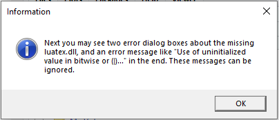
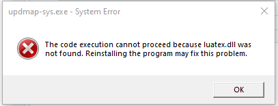
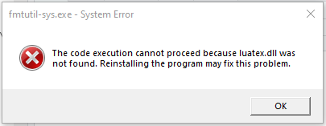

```{r setup, include=FALSE}
knitr::opts_chunk$set(echo = FALSE)
```


## Why R we here?

* **R is a (computing) language and an interpreter that turns commands into...**
    - data manipulation, statistical analysis, graphics, & programming 
    - a useful tool for getting started: [\textcolor{blue}{R Studio IDE}](https://www.rstudio.com/products/rstudio/download/#download) (Integrated Development Environment) \pause

* **Large Community of Users**
    - free software (in both senses)
    - R *packages* on [\textcolor{blue}{**C**omprehensive **R** **A**rchive **Network** (CRAN)}](https://cran.r-project.org/)
    - Google / Stack overflow / Jason \pause
    
* **Make Your Research Reproducible** (and Accessible)
    - [\textcolor{blue}{Dynamic Documents}](https://rmarkdown.rstudio.com/lesson-1.html)
    - [\textcolor{blue}{Shiny Apps}](https://shiny.rstudio.com/gallery/)


## Agenda

* **Sept 1$^{st}$**

  - [\textcolor{blue}{R markdown}](https://rmarkdown.rstudio.com/lesson-1.html) (and dynamic documents)
    + motivation, basic syntax, installation, & simple example \pause
  - Basic R syntax and data structures
    + R script with useful commands for getting started
    + understanding R objects \pause

* **Sept 9$^{th}$**

    - cleaning & preparing data
    - regression
    - making tables & figures

* **GitHub**: [\textcolor{blue}{https://github.com/jarathomas/sociol8802}](https://github.com/jarathomas/sociol8802)


## Motivation: Dynamic Documents

* Use a *single* file to weave data output and substantive text \pause

  - reduce the number of steps to create the final document (e.g., academic article) and efficiently
  reproduce those steps \pause
  
  - if we want publication-quality product, we need a simple language to add structure and formatting...
  enter *markdown* pause
  
  \vspace{12pt}
  
  > "A Markdown-formatted document should be publishable as-is, as plain text, without looking like it’s been marked up with tags or formatting instructions."
  >
  > `r tufte::quote_footer("—-- John Gruber")`


## Motivation: Dynamic Documents (cont.)


* Weave in results/data/tables/figures using **code chunks** -- sections that include R code for
  processing data & creating output \pause
  
* There are several tools for creating dynamic documents that are available in different
stats packages \pause

  - **R Markdown** (powered by **knitr** and **pandoc**) is a popular R package (and rightfully so)
  - output options include: pdf (paper and slides); MS Office (Word & PowerPoint)


## Markdown

Syntax for adding styling to your documents (we'll see this again)

* \*\***this is bold**\*\* and *\* this is italicized *\*

* lists with asterisks, dashes, plus sign (nested lists with indentation)

* section headers (add more \# for subsections)

    + $\Large \mbox{\# Section 1}$
    + $\large \mbox{\#\# Section 2}$

* Web links: `[link name](link url)`:
  - e.g. `[R markdown](https://rmarkdown.rstudio.com/)`
  - [\textcolor{blue}{R markdown}](https://rmarkdown.rstudio.com/)


## Installing R Markdown (& dependencies)

We need to install a few programs & packages to get up and running (all of the default options are fine)

* (good idea to go with RStudio for this) \pause

* Mac users should install **X Quartz** program from [\textcolor{blue}{https://www.xquartz.org/}](https://www.xquartz.org/), which is used by Mac to show plots \pause

* \LaTeX is needed to create PDFs (can do this through R packages as we will now see)


## R Packages for R Markdown

Open R Studio, then copy and paste the following command into the **Console** pane.  

```{r install, eval=FALSE, include=TRUE, echo=TRUE}
install.packages(c("rmarkdown", "tinytex", "rprojroot", "Rcpp"),
                 repos = "http://cran.r-project.org")
```

\pause

* *Note 1:* this assumes you do not have \LaTeX installed on your computer \newline
(which is needed to create PDF files with R Markdown.)

* *Note 2:* **knitr** is an important package that will do the weaving (and gets installed as
a dependency of **rmarkdown**)


## R Packages (cont.)

* Install a small version of \LaTeX  (using the `tinytex` package) with the following command (in the R Studio console)
  
    ```{r tinytex, eval=FALSE, include=TRUE, echo=TRUE}
    tinytex::install_tinytex()
    ```
    
    (this will take a few minutes) \pause

* Windows users may see a warning about needing to install the Rtools program, and 2 warnings complaining about missing files associated with `luatex.dll`

  - but these can all be ignored.


## R Packages (cont.) Warning Messages

* Here are 3 screenshots of the informational and (2) warning messages that Windows users can safely ignore.




## R Packages (cont.) Warning Messages 1

(can safely ignore)




## R Packages (cont.) Warning Messages 2

(can safely ignore)




## R Packages (cont.)

* If you would like to test your `tinytex` installation, close R Studio, then re-open it and run the following command

    ```{r is_tinytex, eval=FALSE, include=TRUE, echo=TRUE}
    tinytex:::is_tinytex()  ## should return TRUE
    ```

* Note the 3 colons after `tinytex`.   If the above command returns a value of `TRUE`, then you are all set.


## Dynamic Document: intro

Let's get some practice making a dynamic document (and using markdown)... \pause

* In the R Studio menu bar: **File**...**New File**...**R Markdown**

  + Choose **Document** (any format is fine) \pause
  
* This will provide us with a basic template for a dynamic document

  + *YAML* block -- section at the top (surrounded by 3 dashes) where we can add title info and set options 
  (e.g., output format is PDF or Word doc)
  
  + **code chunks** -- blocks where we include R commands (that will be evaluated with the results included
  in the dynamic doc) \pause

* Before we dive in a quick markdown review and more on code chunks

## Dynamic Document: markdown syntax

\small

Quick recap of markdown formatting

* \*\***this is bold**\*\* and *\* this is italicized *\*

* lists with asterisks, dashes, plus sign (nested lists with indentation)

* section headers (add more \# for subsections)

    + $\Large \mbox{\# Section 1}$
    + $\large \mbox{\#\# Section 2}$

* Web links: `[link name](link url)`
  - e.g. `[R markdown](https://rmarkdown.rstudio.com/)`
  - [\textcolor{blue}{R markdown}](https://rmarkdown.rstudio.com/)

* Links to References

  - [\textcolor{blue}{cheat sheet (pdf)}](https://www.rstudio.com/wp-content/uploads/2015/02/rmarkdown-cheatsheet.pdf)
  - [\textcolor{blue}{an html ref}](https://stats.oarc.ucla.edu/stat/data/rmarkdown/rmarkdown_seminar_flat.html#spacing-and-paragraphs)


## Dynamic Document: code chunks

\small

A **code chunk** is a *fenced* section that includes R code/commands that can get processed (think R code sandwich)

* bread: 3 backticks, followed by an `{r}`, then code, and closed with another 3 backticks:

````markdown
`r ''````{r, echo = TRUE}
3 + 6
plot(cars)
```
````

\pause
* Useful options:
  + `echo = FALSE` - don't show the code, but do show the results in the dynamic doc
  + `include = FALSE` - exclude code and results from appearing in the dynamic doc 
  + `eval = FALSE` - don't run the code in the code chunk

* [\textcolor{blue}{link to description of all options}](https://yihui.org/knitr/options/#code-evaluation)
   

## Intro to R Syntax & Data Structures

We'll now shift gears a bit and introduce...

1. a few basic R commands for getting started,

2. some logic for understanding types of objects created by R

  + (i.e., different ways we can hold data) \pause
  
* probably best to open up the script `r_script_sept1.R` ([\textcolor{blue}{from GitHub repo}](https://github.com/jarathomas/sociol8802))


## Basic Syntax: useful commands

* `date()` -- useful when running scripts in BATCH mode
* `getwd()` & `setwd()` -- print and set the working directory
* `dir()` or `dir("../")` -- print the files and folders in the given directory
* `ls()` -- print the name of all objects currently loaded in R's memory
* `rm(object1)` -- remove the object called `object1` from R's memory
* Comments are lines that begin with pound/hash/#
* `?date` -- will show the help file for the `date` command
* `help.search("weighted mean")` -- search the help files for the term "weighted mean"


## Basic Syntax: saving & loading data

* `save.image("file_name.RData")` -- save everything in memory to a file called `file_name.RData`
* `save(object1, object2, file = "file_name.RData")` -- save objects called `object1` and `object2` to a file called `file_name.RData`
* `load("file_name.RData")` -- load the data file called "file_name.RData"
* `data <- read.csv("file_name.csv")` -- load the contents of a CSV file


## Basic Syntax: R Packages

* `library()` - list the installed packages
* `library(package name)` - load the package called "package name"
* `install.packages("package name")` - install a package (only need to do this one time)
    + e.g. `install.packages("haven")`
    + install multiple packages with `install.packages(c("dplyr", "ggplott2"))`
* `update.packages()`
* `remove.packages("package name")`


## Data Structures

* Now we'll learn the basic logic for understanding some of the different types of
objects that R uses \pause

* R has different structures for holding data, which can be 
organized by... \pause

    + how many dimensions does it have? \pause

    + do the types of data need to be the same?

  
## Data Structures

* **Vectors** \pause

  1. 1 dimension
  
  1. same data type
    + special case: **factor** (predefined categories)  \pause

* **Matrices** \pause

  1. rows and columns
  
  1. same data type \pause

* **Arrays** \pause

  1. any number of dimensions
  1. same data type \pause

  
## Data Structures

* **Data Frames** \pause

  1. rows and columns
  
  1. different data types \pause

* **Lists** \pause

  1. 1 dimension
  
  1. different data types (and structures)
